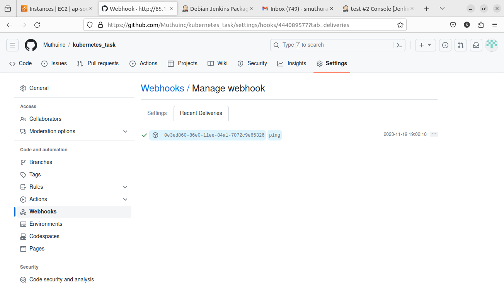

### Setting up jenkins server   

#### Task 1 Verify jenkins installation  
 - followed the official jenkins installation for ubuntu [clickhere](https://pkg.jenkins.io/debian-stable/)  
  
 - Jenkins installed successfully.  

 #### Task 2 CI Pipeline Execution

  - In the github repository webhook set up is by the jenkins url  
  .
  - You can see it is reachable.  
  - In the jenkins dashboard a Pipeline job created with auto-build trigger from github.
  
  - After pushing the files from the local github sent push trigger to the jenkins. 
  .
  - CI part successfull.
  

#### Task 3 CD Pipeline and Deployment

 - For CD Nginx is installed in the ec2 machine.
  
 - Jenkins job has been triggered successfully.
 
 - Few issues with the permission. but finally it came success. As a result new webpage is deployed in the nginx server.
 

##### All the tasks has been successfully completed.
